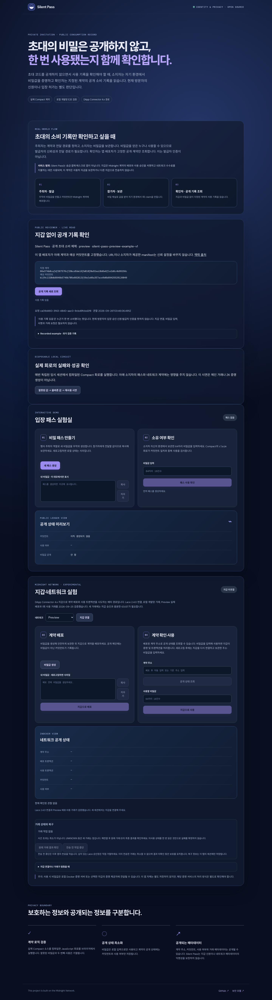

# Silent Pass

[](https://github.com/Haamseongho/midnight_contest/actions/workflows/ci.yml)
[](./LICENSE)

This project is built on the Midnight Network.

**한 줄 설명:** 초대의 비밀은 공개하지 않고, 그 초대가 한 번 사용됐는지는 함께 확인합니다.

Silent Pass demonstrates private secret knowledge and one-time consumption on Midnight. A holder claims in their own environment; a wallet-free reviewer reads a deployment-pinned public contract. A consumed record does not authenticate the presenter, the issuer, or an admission decision.

- Repository: <https://github.com/Haamseongho/midnight_contest>
- Public demo: <https://haamseongho.github.io/midnight_contest/>
- Read-only reviewer: <https://haamseongho.github.io/midnight_contest/review.html> (no wallet or secret input)
- Current enhancement/demo branch: `dev_haams`; `main` is the historical baseline.
- [Enhancement/U3 progress](./docs/ENHANCEMENT_PROGRESS.md), [feature comparison](./docs/FEATURE_COMPARISON.md), [pending human validation](./docs/HUMAN_VALIDATION.md)
- Category: `Identity & Privacy`
- Contract: Compact language 0.23, compiler 0.31.1
- SDK: Midnight.js 4.1.1 and DApp Connector API 4.0.1
- License: [Apache-2.0](./LICENSE)



The screenshot above is the earlier U1–U4 baseline, not evidence of the later A–F enhancement UI. Current checks are recorded in [ENHANCEMENT_PROGRESS.md](./docs/ENHANCEMENT_PROGRESS.md).

## Real-world use case

Event organizers often need to distribute invitation codes while avoiding a public attendee list. A normal on-chain code would reveal the credential and allow observers to copy it. Silent Pass instead treats the secret as a transferable bearer credential:

1. **Organizer:** generates a random 32-byte secret and deploys only its Compact commitment.
2. **Attendee:** receives the contract address and secret through a private authenticated channel.
3. **Reviewer:** reads the pinned public consumption record without a wallet or private input. The app publisher selects the trusted context; this is an off-chain deployment policy, not on-chain issuer authentication.

The current prototype deploys one pass per contract. The same primitive can support private invitations, one-time claim codes, pickup authorizations, or recovery handoffs. It does not hide wallet identity or transaction metadata.

Silent Pass is not a payment, remittance, or escrow application. The connected wallet signs Midnight contract deployment and claim transactions and pays the corresponding network fees; the Silent Pass contract does not custody funds or transfer assets between wallets.

## Why Midnight

| Requirement | Silent Pass implementation |
| --- | --- |
| Keep the credential private | `secret: Bytes<32>` remains a private circuit argument |
| Make verification public | The ledger stores `persistentHash(secret)` and `claimed` |
| Reject an incorrect secret for the selected contract | `claim` asserts that the supplied secret matches the commitment |
| Prevent replay | A successful claim sets `claimed = true`; later claims fail |
| Submit a real transaction | Midnight.js connects proof generation, wallet balancing, submission, and indexer reads |

## Quick start

Requirements:

- Node.js 24.11.1 or newer
- npm
- Compact devtools 0.5.1 with compiler 0.31.1
- A DApp Connector 4.x wallet for browser-wallet testing
- Docker Desktop and Compose for the local-network integration test

The pinned development stack follows the official
[`example-bboard`](https://github.com/midnightntwrk/example-bboard/tree/38bfac8c574abb0c5a96c9e076779716c3e88231)
reference: Midnight.js 4.1.1, Compact runtime 0.16.0, DApp Connector API
4.0.1, local node 0.22.3, indexer 4.0.1, and proof server 8.0.3. Check
the official [compatibility matrix](https://github.com/midnightntwrk/midnight-sdk/blob/main/COMPATIBILITY.md)
before changing any one component independently.

Install the Compact toolchain with the [official installation guide](https://docs.midnight.network/getting-started/installation), then verify the pinned compiler:

```sh
compact update 0.31.1
compact --version
compact compile --version
```

Build, test, and run the browser demo:

```sh
npm ci
npx playwright install chromium
npm run verify
npm run dev
```

Open the local URL printed by Vite. **확인자 전용 화면** opens `review.html`, which omits holder/wallet/scenario paths. Start with **지갑 없이 공개 기록 확인**: this uses the official public indexer and the generated Compact ledger decoder. No wallet is required. The historical transaction card is explicitly marked **Recorded example** and never substitutes for a live read. The public observation download is unsigned, not an admission pass or certificate. Use the main page's four-step judge guide for the actual disposable circuit scenario; advancement requires actual results or an explicitly labelled recorded fallback. Human rehearsal and comprehension checks remain separate.

**실제 회로의 실패와 성공 확인** runs wrong-secret → correct-secret → replay on a fresh disposable circuit session. The manual **입장 패스 실험실** also supports:

1. Generate a pass.
2. Copy the displayed secret.
3. Change one hexadecimal character and confirm that the claim is rejected.
4. Enter the correct secret and confirm that the public state changes to `사용 완료`.

The browser-only laboratory executes JavaScript generated from the compiled Compact contract. It demonstrates circuit behavior but does not submit a blockchain transaction.

## Network transaction demo

The **지갑·네트워크 실험** section implements the DApp Connector 4.x path for Preview, Preprod, and the local `undeployed` network. It supports wallet connection, deployment, public-state lookup, and claiming an existing contract after reconnection.

For a reproducible local transaction test:

```sh
docker compose -f devnet/compose.yml up -d
docker compose -f devnet/compose.yml ps
npm run test:local
docker compose -f devnet/compose.yml stop
```

The local configuration exposes the node at `127.0.0.1:9944`, indexer at `127.0.0.1:8088`, and proof server at `127.0.0.1:6300`. The integration test uses the official public genesis seed only on the disposable `undeployed` network. Never reuse that seed on a public network.

See [the three-minute demo script](./docs/DEMO_SCRIPT.md) for a reviewer-oriented walkthrough. The verified public-network transaction evidence is recorded in the [Preview deployment runbook](./docs/PREVIEW_DEPLOYMENT.md).

For a single Korean-language procedure covering installation, local execution,
local-network E2E, Preview funding, and Lace connection, use the
[run and Lace guide](./docs/RUN_AND_LACE_GUIDE.md). The
[final submission package](./docs/FINAL_SUBMISSION_PACKAGE.md) contains the
ready-to-copy hackathon fields and the last pre-submission checks; it does not
submit the project.

## Architecture

```text
Organizer browser
  ├─ random 32-byte secret (private)
  └─ persistentHash(secret)
             │
             ▼
Midnight contract ledger
  ├─ commitment: Bytes<32> (public)
  └─ claimed: Boolean (public)
             ▲
             │ zero-knowledge claim
Attendee wallet + proof provider
  └─ secret: Bytes<32> (private circuit input)
```

| Component | Responsibility |
| --- | --- |
| `contract/src/silent-pass.compact` | Commitment construction, secret verification, and replay prevention |
| `src/main.ts` | Browser-only circuit demonstration and network interaction UI |
| `src/network/midnight.ts` | Wallet discovery, providers, deploy/join/read/claim operations |
| `src/network/private-state.ts` | Session-scoped contract private state provider |
| `scripts/local-e2e.mjs` | Real local deployment, proof generation, claim, replay rejection, and connector-path test |
| `devnet/compose.yml` | Local node, indexer, and proof-server configuration |

Generated contract bindings and proof artifacts are intentionally excluded from Git. `npm run build` recompiles the contract and synchronizes browser proof assets before TypeScript checking and the Vite production build.

## Privacy boundary

| Private or local | Public or observable |
| --- | --- |
| 32-byte pass secret | Contract address |
| Secret delivery channel | Commitment |
| Attendee name, unless disclosed elsewhere | Claimed status |
| Browser input after it is cleared by the app | Transaction and wallet metadata |

The proof provider or connected wallet may process the private circuit input. This project does not send the secret to an application server, but it cannot guarantee how third-party wallet or proving services handle it. The operating-system clipboard may retain copied secrets.

After storing a pass through an appropriate private channel, use **지우기** to clear both generated and claim-input fields in that section, including claim-input-only cases. Public contract state is unchanged. JavaScript strings cannot be reliably zeroized, and this control does not erase clipboard history or copies saved outside the app. In-flight proof inputs can remain in an outstanding operation until it settles.

Read [SECURITY.md](./SECURITY.md) for the threat model, disclosure process, trust boundaries, and known limitations.

## Verification evidence

The standard verification command is:

```sh
npm run verify
```

It performs:

- Compact contract compilation with compiler 0.31.1
- Proof-key and ZKIR synchronization checks
- TypeScript static checking
- Vite production build
- Production dependency audit at high severity or above
- Contract-state and privacy-invariant tests
- Wrong-secret and replay-rejection tests
- Real Chromium DOM regressions for clearing, request ordering, read failures, reviewer context, and operation recovery
- Product-scope and submission-document consistency checks
- Repository attribution and license checks

`npm run test:local` separately verifies actual local-network deployment and claim transactions through both the direct SDK and the application's DApp Connector route.

`npm run test:preview` performs a fresh-browser read of the pinned actual Preview contract and asserts zero wallet API access, private inputs, and transaction requests. It needs internet access and is kept separate from deterministic `verify`.

`npm run test:local` also broadcasts an actual claim, deliberately drops the connector reply, restores the operation metadata, reconnects, and resolves the exact transaction ID. A read of `unclaimed` is never treated as proof of transaction failure.

## Reviewer and operation boundaries (dev_haams)

- Trusted context: [`src/context/trusted-context.ts`](./src/context/trusted-context.ts). Event label, network, contract, expected commitment, source and policy version are bundled by the app publisher. URL parameters and holder manifests cannot change them. Trusting the deployment and its public indexer is necessary; this is not issuer authentication or a light-client proof.
- Live observations carry request ID and observation time. Network/address/commitment/version mismatches, malformed data and timeouts never produce a success state. New requests invalidate previous results; history has its own card.
- Transactions retain only public operation metadata in this tab's `sessionStorage`. A timeout becomes `UNKNOWN`, not cancellation. Late completion updates the same operation. Reconnection/reload preserves the guard; exact transaction reconciliation can resolve it.
- Before submission, **전송 전 작업 중단** prevents a late wallet response from reaching the app's submit call. Reject any remaining Lace dialog yourself. After submission, the guard remains until a matching final success/failure is observed. A missing indexer result cannot prove non-inclusion. Session data does not coordinate different tabs/devices and closing the tab can lose recovery metadata; retain public tx IDs.
- Circuit, ABI and proving keys are unchanged. Old Preview transactions remain historical evidence, not evidence of the new UI. See [implementation evidence](./docs/IMPLEMENTATION_EVIDENCE.md) and [benchmark checklist](./docs/BENCHMARK_CHECKLIST.md).

Existing work already covers ZK ticketing ([Lens & Frens](https://ethglobal.com/showcase/lens-and-frens-ogedp)), identity plus email ticket verification ([Zhat's Me](https://ethglobal.com/showcase/zhats-me-vioyt)), and secret-based asset claims ([Selkie](https://github.com/DpacJones/selkie-usdm-escrow)). Silent Pass makes no novelty or equivalent-feature claim: its deliberately small scope is one-time consumption plus a deployment-pinned public read and recoverable transaction status. It implements neither identity/email verification nor asset escrow.

### Current verified state

- Contract compilation, production build, and automated tests pass locally.
- The public GitHub Pages demo and its proving-key/ZKIR asset paths return HTTP 200.
- A fresh clone has previously reproduced `npm ci`, `npm run build`, and `npm test`.
- Local `undeployed` transactions have verified deployment, proof generation, state reads, wrong-secret rejection, a successful claim, and replay rejection.
- The connector application path has been exercised with the official local test-wallet adapter, including reconnecting to an existing contract.
- Deployment and claim now stop before proof generation or submission when Lace reports a zero tDUST balance, with separate guidance for an empty balance and a zero generation cap.
- Public [GitHub Actions run 36126468920](https://github.com/Haamseongho/midnight_contest/actions/runs/36126468920) passed both `verify` and `local-e2e` for Preview-evidence commit `76d6610`; the former includes the production dependency audit and all 20 automated tests, and the latter started a fresh pinned Midnight Docker stack, waited for initial DUST accrual, and exercised the direct SDK and DApp Connector application paths.
- Public [GitHub Pages run 36126468936](https://github.com/Haamseongho/midnight_contest/actions/runs/36126468936) deployed the same `76d6610` commit successfully; the live demo and its prover-key/ZKIR URLs returned HTTP 200.
- Lace 2.4.0 browser-extension approval and the Preview DApp Connector 4.x handshake were verified on 2026-09-24; the public demo reported `preview 연결됨` after the user approved the DApp.
- The current official Preview funding flow uses the Preview faucet for tNIGHT and Lace **Generate tDUST** to register that tNIGHT for tDUST generation. Holding tNIGHT alone is not sufficient.
- Lace completed the Preview tNIGHT-to-tDUST registration on 2026-09-25, showed `All done`, and reported a positive, refilling tDUST balance. No wallet address or secret is recorded in this repository.
- Preview deployment and claim were verified through Lace 2.4.0 on 2026-09-25. Contract `66e374b0cafdf387576cf29bcd5de16fb010f0e92ea10d6e6f1e2d6c4b99256c` was deployed in transaction `0009965462a734559665acff00e767c2de22a4f18ce689c7045f94e4ce9b356c2e`, claimed in transaction `0032856554b96a452286646176f4a0e689808d22615069eb9a498973493cee35dc`, and read back from the Preview indexer as `claimed = true`. The app cleared both secret fields after success; no wallet address or pass secret is published.
- Preprod has not been exercised and is not claimed as verified.

## Known limitations

- One pass requires one contract deployment.
- Passes have no expiry, revocation, recipient binding, or recovery flow.
- Anyone who learns the secret can claim the pass; this transferability is intentional.
- The browser-only laboratory is a local circuit demonstration, not a network transaction.
- The project has not received an independent security audit.
- The initial bundle includes Midnight WebAssembly runtimes and is larger than a typical static website.

## Awesome Midnight dApps readiness

The repository follows the official [Awesome Midnight contribution guide](https://github.com/midnightntwrk/midnight-awesome-dapps/blob/main/CONTRIBUTING.md):

- Apache-2.0 license
- Exact ecosystem attribution sentence near the top of this README
- Functional Compact code and a reproducible build
- A factual real-world Midnight Network use case
- Security limitations and upstream credits
- CI workflow and reviewer demo script

Remote-only and deployment checks are tracked in [the readiness checklist](./docs/AWESOME_DAPPS_CHECKLIST.md). The proposed list entry is:

```md
- [Silent Pass](https://github.com/Haamseongho/midnight_contest) - One-time access-pass DApp that proves knowledge of a private secret while publishing only its commitment and claimed status on Midnight Network. - [Demo](https://haamseongho.github.io/midnight_contest/)
```

The exact upstream placement and pull-request draft are recorded in [the submission draft](./docs/AWESOME_DAPPS_SUBMISSION.md).

## Upstream attribution

- Built with the [Midnight Compact compiler](https://github.com/midnightntwrk/compact) and official Midnight.js packages.
- Browser-wallet and local-stack versions follow the official [Bulletin Board DApp reference](https://github.com/midnightntwrk/example-bboard/tree/38bfac8c574abb0c5a96c9e076779716c3e88231).
- The local Docker topology and test approach follow the Apache-2.0-licensed [Midnight Local Dev](https://github.com/midnightntwrk/midnight-local-dev) project.
- Continuous integration uses the official [Setup Compact Action](https://github.com/midnightntwrk/setup-compact-action).
- Version compatibility follows the official [support matrix](https://docs.midnight.network/relnotes/support-matrix).

## Contributing and license

See [CONTRIBUTING.md](./CONTRIBUTING.md) before opening a change. Silent Pass is licensed under the [Apache License 2.0](./LICENSE).
